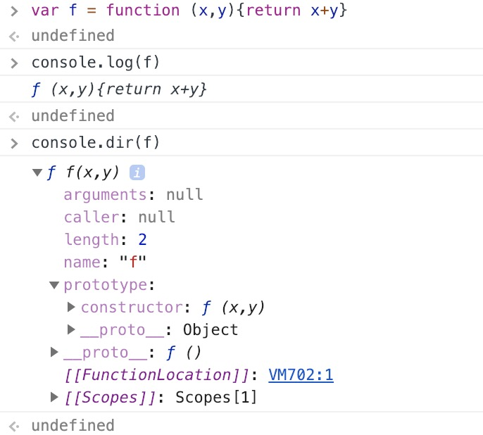

# 函数
## 函数声明
函数就是一个可以反复调用的代码块，可以传入参数，可以有返回值

声明一个函数有五种方式

第一种：这种声明会存在函数提升，即使函数声明代码放在调用函数代码的后面，也是可以的，和变量的声明提升是一样的
``` js
function xxxx (x1, x2, ...){
    // 函数所要执行的代码
}

// 访问函数可以直接使用 xxxx 标志符访问
```

第二种：使用一个变量来保存匿名函数
``` js
var x = function (x1, x2, ...) {
    // 函数所要执行的代码
}
// 访问函数可以通过变量 x 访问
```

第三种：第一、二种的结合版
``` js
var x = function xxx() {
    // 函数所要执行的代码
}
```
::: warning
这种方式还是只能通过 x 来访问函数，不能通过 xxx 访问
:::

第四种：使用`window.Function`函数对象定义
``` js
var x = new Function(x1, x2, ... , lastone)
// lastone 为函数体所要执行的代码，类型为字符串
// 之前传递的参数都是函数定义的参数
```

第五种：箭头函数（es6语法）方式
``` js
var x = (x1, x2, ...) => {
    // 函数所要执行代码
}

// 函数体只有一行 return 语句时，可以简写成如下形式
var x = (x1, x2, ...) => x1 + x2 + ....
// 函数参数只有一个时可以简写如下形式
var x = x1 => {
    ...
    return x1 * x1
}
```

## 函数的本质
在浏览器中声明一个函数，打印出来如下

由上图可以，函数的本质也是一个对象，有arguments、caller、length、name等属性，对象的原型prototype的指向了Object.prototype，对象的`__proto__`指向了Function.prototype，这也就是为什么函数可以使用apply，bind，call等方法的原因

所以说函数本质上也是一个对象，这个对象的`__proto__`指向了Function.prototype

下面来介绍es6中的箭头函数

## 箭头函数的基本语法
``` js
let fn = (param1, param2, ...) => {
    // 函数体代码
}
// 当只有一个参数或者函数体只有一条语句则可以这么写
let fn = param1 => 语句
```
从上面代码看只是换了一种简洁方式声明一个函数，但是远不止这么简单

### es6箭头函数解决了什么问题
先来看es6之前的函数的一个问题，看如下代码
``` js
let name = 'window'
function getName() {
    console.log(this)
}
let obj = {
    name: 'obj',
    getName: getName 
}

getName() // 等价于window.getName(), this的值是window
obj.getName() // this的值时obj

getName.call(obj) 
obj.getName.call(window)
```

由上面代码可知，函数的this值是有调用的时候决定的，一般是指向`.`前面那个对象，使用call来调用时，call的第一个参数就是this，call第二个之后的参数都会当做函数调用时的参数。函数里面的`this`，本质上就是call函数的第一个参数。

但是箭头函数是没有上面这个规则的，不管你使用哪种方式调用，我是不管this的，由于函数内是没有this，由于作用域链的关系，会往作用域链上面找，所以会是`window`对象

``` js
let name = 'window'
let getName = () => {
    console.log(this)
}
let obj = {
    name: 'obj',
    getName: getName,
    getThis: function () {
        return () => {
            console.log(this)
        }
    } 
}

// 箭头函数内不存在 this, 就会往作用域上找到this
getName() // window
obj.getName() // window

getName.call(obj) //window
obj.getName.call(window) //window

obj.getThis()() // 由作用域链往上找，最终的this就是obj
```
总结:

1. 箭头函数内不存在`this`, 需要this的时候会去作用域链的上端找，
2. es6之前的函数声明的`this`, 使用调用的时候决定，本质上是由call的第一个参数决定的