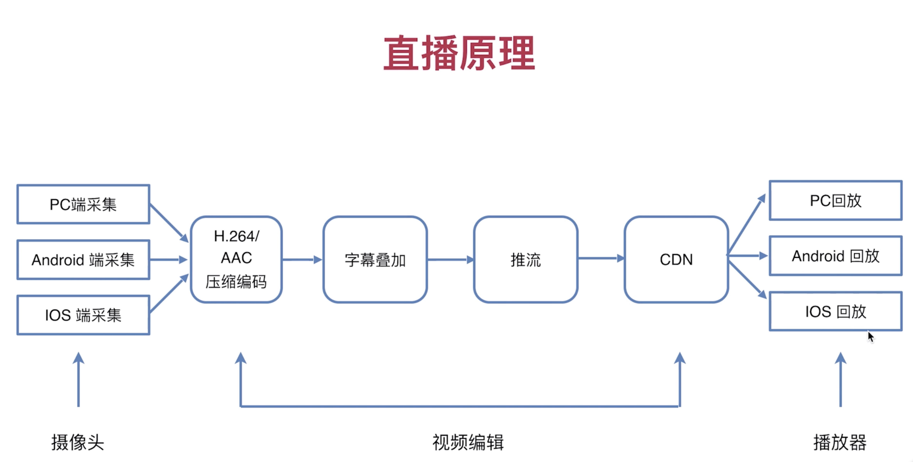
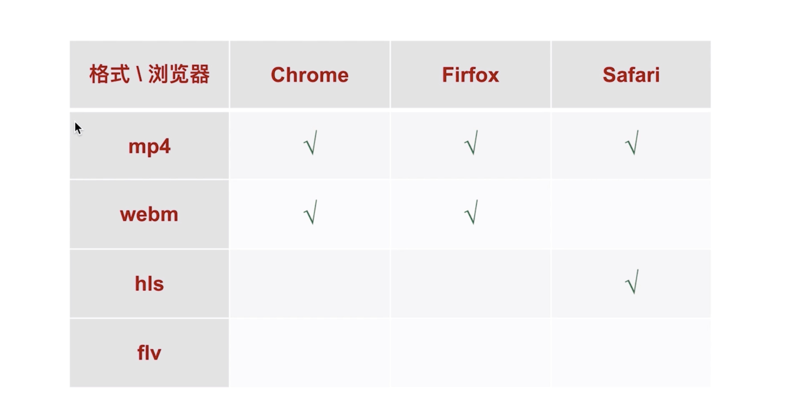
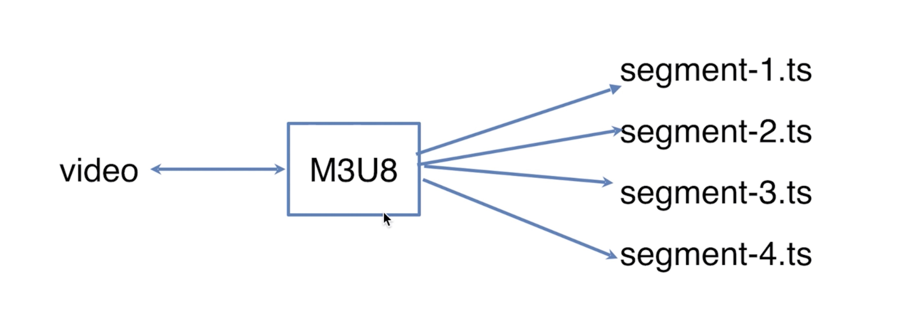
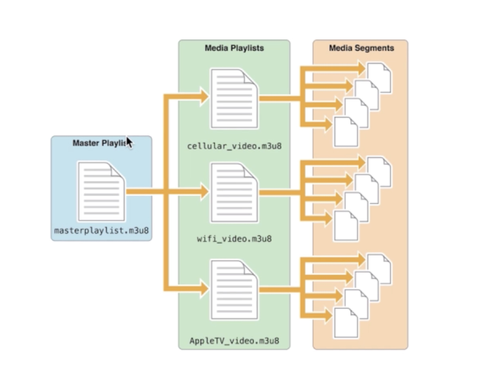
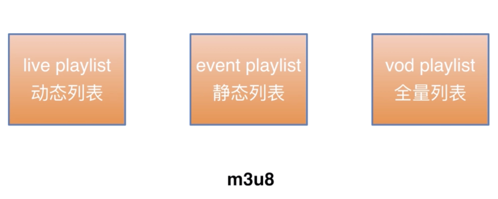
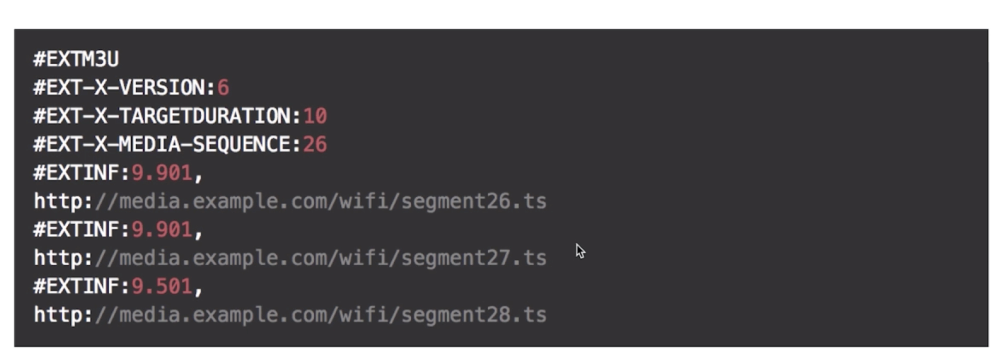
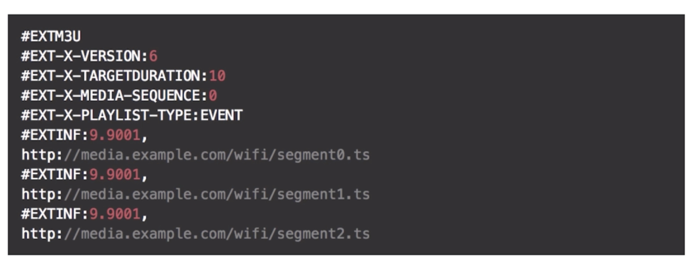
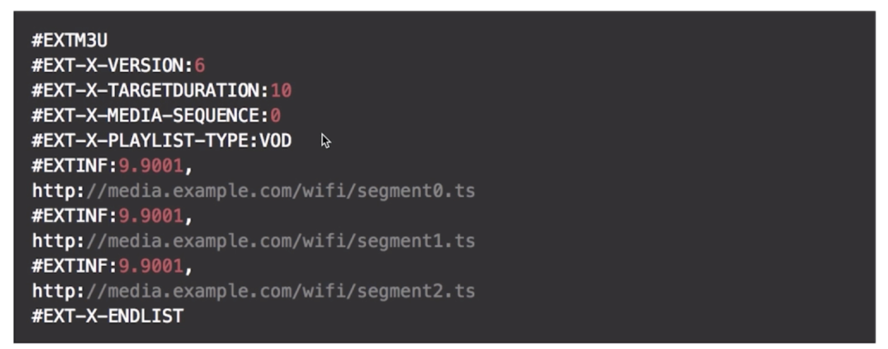

# 直播原理


## 直播流程
大概可以分成三大块：
1. 视频采集
2. 视频编辑
3. 视频播放

### 视频采集
视频采集包括：
1. PC端
2. IOS端
3. Android端

PC端采集一般是主流，PC端采集可以接入一些专业的麦克风和摄像设备来保证采集画面的质量，
移动端（IOS和Android）只能依靠移动设备自带的摄像头和麦克风，画面质量肯定不如PC端，
但是移动端采集相对于PC端更加便捷。

### 视频编辑

### 压缩编码
通过麦克风和摄像头采集到的音频和视频需要经过压缩编码，H.264是视频格式的编码，AAC是音频格式的编码，这两种是
主流的编码格式

### 视频加工
这里可以做一些效果的加入，比如字幕叠加、水印等，这步不是必须的

### 推送到服务器
接下来就可以将加工好的视频推送到服务器，服务器再将推上来的流部署到CDN，供客户端访问

### 视频播放
客户端通过CDN地址，使用播放器，就可以播放直播视频。

上诉过程中：视频推送到服务器、客户端播放都需要通过特殊协议进行通信。接下来介绍几种直播的主流通信协议。

## 浏览器支持视频格式


mp4和webm视频格式在视频点播上面的使用比较多，hls和flv则在直播上面使用比较多

## 主流直播协议
主流直播协议有如下三种：
1. HLS协议
2. RTMP协议
3. HTTP-FLV协议

### hls协议


hls协议主要用于客户端直播

给video标签的src属性设置一个m3u8格式的文件地址，m3u8文件包含了很多个ts文件的访问地址，浏览器会将ts文件解析成能播放的视频，由于hls是苹果公司自己开发的一套协议，目前只有safari浏览器能直接播放hls协议的直播流，其它浏览器需要支持hls协议可以引入[hls.js](https://github.com/video-dev/hls.js)


m3u8文件是可以嵌套多个m3u8文件的，子的m3u8文件再携带ts的文件信息

#### m3u8文件类型


#### 动态列表
这种类型是用于直播中使用，浏览器会根据m3u8文件会携带ts文件中的时长信息，浏览器根据这些时长信息，会定时更新m3u8文件，这样视频就会一直处于更新状态。由此可知，hls协议肯定会有直播的延时，具体延时是根据ts文件中的时长。

#### 静态列表
直播中基本不会使用这种类型

#### 全量列表
这种类型一般是做点播，比如有人错过了直播，直播提供回放的话就会把保留一个全量列表的一个m3u8文件，里面包括了所有的ts文件。

#### 三种m3u8文件的具体内容
m3u8文件是一个纯文本文件。
m3u8嵌套了m3u8文件示例，这个m3u8文件携带了多个m3u8文件的地址。
```
#EXTM3U
#EXT-X-STREAM-INF:PROGRAM-ID=1,BANDWIDTH=500000,RESOLUTION=640x360
/hls-live/goodtv/_definst_/liveevent/live-ch1-1.m3u8
#EXT-X-STREAM-INF:PROGRAM-ID=1,BANDWIDTH=1200000,RESOLUTION=853x480
/hls-live/goodtv/_definst_/liveevent/live-ch1-2.m3u8
#EXT-X-STREAM-INF:PROGRAM-ID=1,BANDWIDTH=2000000,RESOLUTION=1280x720
/hls-live/goodtv/_definst_/liveevent/live-ch1-3.m3u8
#EXT-X-STREAM-INF:PROGRAM-ID=1,BANDWIDTH=128000,CODECS="mp4a.40.2"
/hls-live/goodtv/_definst_/liveevent/live-ch1-1_audio_only.m3u8
```
下面是三种不同类型的示例

动态列表:

静态列表:

全量列表:


1. EXT-X-VERSION:----表示协议的版本号
2. EXT-X-TARGETDURATION:----表示默认的视频时长
3. EXT-X-MEDIA-SEQUENCE:----表示当前m3u8文件的索引
4. EXTINF:----表示下面的ts文件的大概时长是多少
5. EXT-X-PLAYLIST-TYPE:----静态列表和全量列表会携带这一行信息，静态列表的值为EVENT，全量列表为VOD
6. EXT-X-ENDLIST:----全量列表会携带这一行信息，告诉浏览器，解析到这里就没有m3u8文件需要更新了

### RTMP协议
RTMP是Real Time Messaging Protocol的首字母缩写。该协议基于TCP，是一个协议族，包括RTMP基本协议及RTMPT、RTMPS、RTMPE等多种变种。
RTMP是一种设计用来进行实时数据通信的网络协议，主要用来Flash、AIR平台和支持RTMP协议的流媒体/交互服务器之间进行音视频和数据通信

RTMP协议可用于客户端推流的通信协议，也可用于播放端.

RTMP协议返回的视频文件是flv格式的

### HTTP-FLV协议
HTTP-FLV，即将音视频数据封装成 FLV，然后通过 HTTP 协议传输给客户端。HLS 其实是一个 “文本协议”，而并非流媒体协议。那么，什么样的协议才能称之为流媒体协议呢？

流(stream)： 数据在网络上按时间先后次序传输和播放的连续音/视频数据流。之所以可以按照顺序传输和播放连续是因为在类似 RTMP、FLV 协议中，每一个音视频数据都被封装成了包含时间戳信息头的数据包。而当播放器拿到这些数据包解包的时候能够根据时间戳信息把这些音视频数据和之前到达的音视频数据连续起来播放。MP4、MKV 等等类似这种封装，必须拿到完整的音视频文件才能播放，因为里面的单个音视频数据块不带有时间戳信息，播放器不能将这些没有时间戳信息数据块连续起来，所以就不能实时的解码播放。

相对于RTMP协议的优点：
- 可以在一定程度上避免防火墙的干扰 （例如, 有的机房只允许 80 端口通过）；
- 可以很好的兼容 HTTP 302 跳转，做到灵活调度；比如分布式中某个节点故障了，就可以通过302重定向到其它节点
- 可以使用 HTTPS 做加密通道；
- 很好的支持移动端（Android，IOS）；

## 总结
HLS是一个文本协议，不需要和服务器进行长连接，延时取决于对TS文件分片的多少，RTMP和HTTP-FLV需要和服务器进行长连接，实时性比较好。HLS协议相对于其它两种使用更为简单。