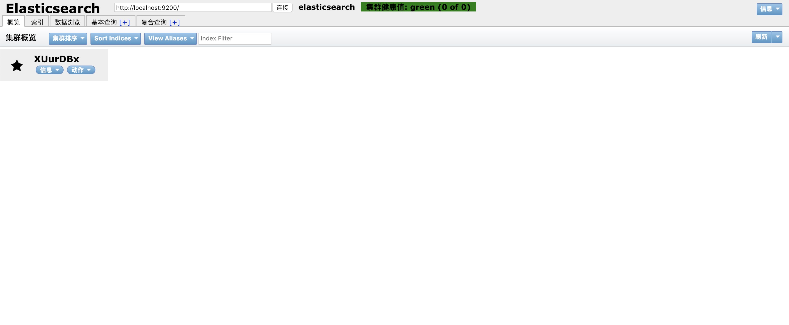

# ElasticSearch

## ElasticSearch简介
ElasticSearch是基于Apache Lucene构建的开源搜索引擎；采用java编写，提供了简单易用的RESTFul API，由于是使用java编写，运行环境的JAVA的JDK版本必须>=1.8；支持分布式集群，轻松的进行横向扩展

### 应用场景
- 海量数据分析引擎
- 站内搜索引擎
- 数据仓库

## 安装
在[官网下载](https://www.elastic.co/downloads/elasticsearch)下载压缩包（6.6.0版本），解压后进入目录，目录结构如下
``` bash
-rw-r--r--@  1 simon  staff    13K Jan 24 19:24 LICENSE.txt  
-rw-r--r--@  1 simon  staff   394K Jan 24 19:29 NOTICE.txt
-rw-r--r--@  1 simon  staff   8.3K Jan 24 19:24 README.textile
drwxr-xr-x@ 45 simon  staff   1.4K Jan 24 19:29 bin // 可执行文件目录，程序启动文件在此目录
drwxr-xr-x@ 11 simon  staff   352B Feb 12 09:47 config   // 配置文件目录
drwxr-xr-x   3 simon  staff    96B Feb 12 09:38 data     // 数据存放目录
drwxr-xr-x@ 42 simon  staff   1.3K Jan 24 19:29 lib      // 第三方库目录
drwxr-xr-x@  9 simon  staff   288B Feb 12 09:38 logs     // 日志存放目录
drwxr-xr-x@ 29 simon  staff   928B Jan 24 19:29 modules  // 模块目录
drwxr-xr-x@  2 simon  staff    64B Jan 24 19:29 plugins  // 插件目录
```

### 启动
在`bin`目录在命令行执行`./elasticsearch`，看到命令行中有started字样，说明服务已启动，加入`-d` 参数，服务将会以守护进程启动；在命令行输入`curl http:localhost:9200`，命令行将会得到如下的JSON数据，说明服务可以正常使用
``` json
{
  "name" : "XUurDBx",
  "cluster_name" : "elasticsearch",
  "cluster_uuid" : "YZfq31QXQEGnFGYEWuK7SQ",
  "version" : {
    "number" : "6.6.0",
    "build_flavor" : "default",
    "build_type" : "tar",
    "build_hash" : "a9861f4",
    "build_date" : "2019-01-24T11:27:09.439740Z",
    "build_snapshot" : false,
    "lucene_version" : "7.6.0",
    "minimum_wire_compatibility_version" : "5.6.0",
    "minimum_index_compatibility_version" : "5.0.0"
  },
  "tagline" : "You Know, for Search"
}
```

### UI界面管理插件
为了可视化管理es中的数据，在github上有一个插件[elasticsearch-head](https://github.com/mobz/elasticsearch-head)，该插件是使用前端技术构建的一个可视化界面管理工具。按照github上面的文档即可运行起来，运行起来后，在浏览器访问对应的地址就可以访问可视化界面了
### elasticsearch-head的google插件
之前这种下载源码的方式比较繁琐，这里提供一种简便的方式

先去[google插件商店](https://chrome.google.com/webstore/category/extensions?hl=zh-CN)搜索`elasticsearch-head`，下载插件

下载好之后，点击插件处的elasticsearch-head的图标，就会行打开一个页面，这个页面和上一种方式的页面
是一样的，界面如图



## 分布式配置
首先修改我们之前的服务的配置文件`config/elasticsearch.yml`

### 主节点配置
这个是master节点的配置，在文件最后加入如下的配置
``` txt
http.cors.enabled: true    // 设置是否可以跨域访问
http.cors.allow-origin: "*"   // 设置任何域名都可以访问

cluster.name: test   // 设置集群名
node.name: master    // 设置节点名
node.master: true    // 设置是否为主节点

network.host: 127.0.0.1   // 设置提供访问的ip
```

重启之前的服务，在命令行执行`curl http://localhost:9200`，
即可得到如下结果，name和cluster_name都变成了我们设置的名字
``` JSON
{
  "name" : "master",
  "cluster_name" : "test",
  "cluster_uuid" : "YZfq31QXQEGnFGYEWuK7SQ",
  "version" : {
    "number" : "6.6.0",
    "build_flavor" : "default",
    "build_type" : "tar",
    "build_hash" : "a9861f4",
    "build_date" : "2019-01-24T11:27:09.439740Z",
    "build_snapshot" : false,
    "lucene_version" : "7.6.0",
    "minimum_wire_compatibility_version" : "5.6.0",
    "minimum_index_compatibility_version" : "5.0.0"
  },
  "tagline" : "You Know, for Search"
}
```

### 从节点配置
由于本地开发环境只有一台机器，所以使用不同端口号来实现从节点的配置

``` txt
cluster.name: test   // 设置集群名,此名称必须和主节点的名称保持一致 
node.name: slave1    // 设置节点名

network.host: 127.0.0.1   // 设置提供访问的ip
// 不配置端口号的情况默认会是用9200，由于主节点是没配置的，所以从节点需要配置一个另外的端口
// 生产环境多台机器的情况下，配置不同的访问ip即可
http.port: 9201   

// 指定主节点的ip地址
discovery.zen.ping.unicast.hosts: ["127.0.0.1"]
```

这样就是实现了ElasticSearch的扩容

## 基础概念
1. 集群和节点

一个集群是由一个或多个es节点组成的，每个节点都有自己的节点名称和同样的集群名字，节点可以存储数据、参与集群索引数据、搜索数据

2. 索引

含有相同属性的文档集合，表示一类相同类型的数据，比如用户信息数据是一个索引，产品数据是一个索引

3. 类型

索引可以定义一个或者多个类型，文档必须属于一个类型

4. 文档

文档是可以被索引的基本数据单位，比如一个用户的信息

5. 分片
每个索引都有多个分片，每个分片是一个lucene索引，分片只能在创建索引时指定，创建之后不能修改

6. 备份
拷贝一份分片就完成了分片的备份，备份在创建索引时需要指定，后期也可以修改


## 基本用法
ElasticSearch的API风格是RESTFul，调用api的基本格式如下
```
http://<ip>:<port>/<索引>/<类型>/<文档ID>
```
RESTFul风格的API会使用到这几种http请求方式
- GET
- POST
- PUT
- DELETE

### 创建索引
索引分结构化和非结构化两种，他们的区别就是索引信息中的mappings字段，非结构化索引这个字段是一个空对象

之前的head插件创建的索引，查看索引信息的时候，可以知道是非结构化的索引

#### 结构化索引创建
这里使用postman工具来调用api来创建一个结构化索引

通过postman请求`http://127.0.0.1:9200/people`，请求方式为PUT，创建一个结构化的索引

请求体的json数据如下
``` json 
{
	"settings": {
		"number_of_shards": 3, // 指定索引的分片数
		"number_of_replicas": 1 // 设置分片的备份数
    },
    // 定义索引的结构映射
	"mappings": {
		"man": {
			"properties": {
				"name": {
					"type": "text"
				},
				"country": {
					"type": "keyword"
				},
				"age": {
					"type": "integer"
				},
				"date": {
					"type": "date",
					"format": "yyyy-MM-dd HH:mm:ss||yyyy-MM-dd||epoch_millis"
				}
			}
		}
	}
}
```
提交请求后，得到如下如下响应说明创建索引成功
``` json
{
    "acknowledged": true,
    "shards_acknowledged": true,
    "index": "people"
}
```

### 数据插入
数据插入有两种方式：
1. 指定文档id插入
2. 自动产生文档id插入
id是一个文档数据的唯一标记，和mysql中的主键id是相似的

#### 指定文档id插入
使用put方式请求地址`http://127.0.0.1:9200/people/man/1`

请求体数据如下
``` json
{
	"name": "test1",
	"country": "China",
	"age": 30,
	"date": "2019-02-01"
}
```
得到如下响应，result为created，说明创建文档成功
``` json
{
    "_index": "people",
    "_type": "man",
    "_id": "1",
    "_version": 1,
    "result": "created",
    "_shards": {
        "total": 2,
        "successful": 2,
        "failed": 0
    },
    "_seq_no": 0,
    "_primary_term": 1
}
```

#### 自动产生文档id插入
使用post方式请求地址`http://127.0.0.1:9200/people/man/`，需要去掉携带的id

请求体数据如下
``` json
{
	"name": "test2",
	"country": "China",
	"age": 40,
	"date": "2019-02-01"
}
```
得到如下响应，result为created，说明创建文档成功，并且可以看到_id的值是一段ElasticSearch自动帮我们生成的，
``` json
{
    "_index": "people",
    "_type": "man",
    "_id": "uqQa4mgBZ6y0pzcw4UAj",
    "_version": 1,
    "result": "created",
    "_shards": {
        "total": 2,
        "successful": 2,
        "failed": 0
    },
    "_seq_no": 0,
    "_primary_term": 1
}
```
### 数据修改
修改上面创建id为1的数据

使用post方式请求地址`http://127.0.0.1:9200/people/man/1/_update`

请求体数据如下
``` json
{
	"doc": {
		"name": "test33333"  //  修改name的值
	}
}
```
得到如下响应，result为updated，说明更新文档成功
``` json
{
    "_index": "people",
    "_type": "man",
    "_id": "1",
    "_version": 2,
    "result": "updated",
    "_shards": {
        "total": 2,
        "successful": 2,
        "failed": 0
    },
    "_seq_no": 1,
    "_primary_term": 1
}
```

### 数据删除
索引和文档都可以被删除，索引一旦删除，该索引下的文档都会被删除

#### 文档删除
删除之前id为1的文档数据

使用delete方式请求地址`http://127.0.0.1:9200/people/man/1`

得到如下响应，result为deleted，说明id为1的文档删除成功
``` json
{
    "_index": "people",
    "_type": "man",
    "_id": "1",
    "_version": 3,
    "result": "deleted",
    "_shards": {
        "total": 2,
        "successful": 2,
        "failed": 0
    },
    "_seq_no": 2,
    "_primary_term": 1
}
```

#### 索引删除
删除之前创建的people索引

使用delete方式请求地址`http://127.0.0.1:9200/people`

得到如下响应，说明索引删除成功
``` json
{
    "acknowledged": true
}
```

### 数据查询
有三种类型的查询
1. 简单查询
2. 条件查询
3. 聚合查询

#### 简单查询
简单查询是通过id来查找数据的，首先需要创建一个book索引做测试，索引的结构如下，按照之前的方式创建book索引，随便加入几条数据用于测试
``` json 
{
	"settings": {
		"number_of_shards": "3",
		"number_of_replicas": "1"
	},
	"mappings": {
		"novel": {
			"properties": {
				"date": {
					"format": "yyyy-MM-dd HH:mm:ss||yyyy-MM-dd||epoch_millis",
					"type": "date"
				},
				"word_count": {
					"type": "integer"
				},
				"author": {
					"type": "keyword"
				},
				"title": {
					"type": "text"
				},
				"publish_date": {
					"type": "date"
				}
			}
		}
	}
}
```

使用postman工具，请求`http://127.0.0.1:9200/book/novel/1`,请求方式为get，就可以获取到id为1的数据

响应结果如下，id为1的数据就在_source字段中
``` json
{
    "_index": "book",
    "_type": "novel",
    "_id": "1",
    "_version": 1,
    "_seq_no": 0,
    "_primary_term": 1,
    "found": true,
    "_source": {
        "author": "谁谁谁",
        "title": "测试小说1",
        "word_count": 10000,
        "publish_date": "2019-02-01"
    }
}
```

#### 条件查询
条件查询使用的是post方式，查询条件是使用json字符串来描述

使用postman工具，请求`http://127.0.0.1:9200/book/_search`,请求方式为post

请求体如下
``` json
{
	"query": {
        // 匹配所有数据
		"match_all": {
			
		}	
	}
}
```
响应结果，数据都在hits字段中，total表示数据的总数，里面的hits是所有找到的数据
``` json
{
    "took": 14,
    "timed_out": false,
    "_shards": {
        "total": 3,
        "successful": 3,
        "skipped": 0,
        "failed": 0
    },
    "hits": {
        "total": 10,
        "max_score": 1,
        "hits": [
            {
                "_index": "book",
                "_type": "novel",
                "_id": "2",
                "_score": 1,
                "_source": {
                    "author": "谁谁谁",
                    "title": "恐怖小说1",
                    "word_count": 10020,
                    "publish_date": "2019-02-01"
                }
            },
            {
                "_index": "book",
                "_type": "novel",
                "_id": "4",
                "_score": 1,
                "_source": {
                    "author": "谁谁谁",
                    "title": "推理小说1",
                    "word_count": 10020,
                    "publish_date": "2019-02-01"
                }
            },
            {
                "_index": "book",
                "_type": "novel",
                "_id": "5",
                "_score": 1,
                "_source": {
                    "author": "谁谁谁",
                    "title": "推理小说2",
                    "word_count": 10020,
                    "publish_date": "2019-02-01"
                }
            },
            {
                "_index": "book",
                "_type": "novel",
                "_id": "6",
                "_score": 1,
                "_source": {
                    "author": "谁谁谁",
                    "title": "推理小说3",
                    "word_count": 10020,
                    "publish_date": "2019-02-01"
                }
            },
            {
                "_index": "book",
                "_type": "novel",
                "_id": "7",
                "_score": 1,
                "_source": {
                    "author": "谁谁谁",
                    "title": "推理小说4",
                    "word_count": 10020,
                    "publish_date": "2019-02-01"
                }
            },
            {
                "_index": "book",
                "_type": "novel",
                "_id": "8",
                "_score": 1,
                "_source": {
                    "author": "谁谁谁",
                    "title": "推理小说5",
                    "word_count": 10020,
                    "publish_date": "2019-02-01"
                }
            },
            {
                "_index": "book",
                "_type": "novel",
                "_id": "1",
                "_score": 1,
                "_source": {
                    "author": "谁谁谁",
                    "title": "测试小说1",
                    "word_count": 10000,
                    "publish_date": "2019-02-01"
                }
            },
            {
                "_index": "book",
                "_type": "novel",
                "_id": "3",
                "_score": 1,
                "_source": {
                    "author": "谁谁谁",
                    "title": "恐怖小说2",
                    "word_count": 10020,
                    "publish_date": "2019-02-01"
                }
            },
            {
                "_index": "book",
                "_type": "novel",
                "_id": "9",
                "_score": 1,
                "_source": {
                    "author": "谁谁谁",
                    "title": "推理小说6",
                    "word_count": 10020,
                    "publish_date": "2019-02-01"
                }
            },
            {
                "_index": "book",
                "_type": "novel",
                "_id": "10",
                "_score": 1,
                "_source": {
                    "author": "谁谁谁",
                    "title": "推理小说7",
                    "word_count": 10020,
                    "publish_date": "2019-02-01"
                }
            }
        ]
    }
}
```
#### 分页查询
正常情况我们不会去查询整个索引的所有数据，下面来对查询条件进行一点修改
``` json 
{
	"query": {
		"match_all": {}
	},
	"from": 1,   // 从第几条数据开始
	"size": 1    // 获取几条数据
}
```
获取响应如下，可以看到只获取了第一条数据，就是之前查询到的第一条数据，这样就可以使用from和size来对数据进行分页查询
``` json
{
    "took": 10,
    "timed_out": false,
    "_shards": {
        "total": 3,
        "successful": 3,
        "skipped": 0,
        "failed": 0
    },
    "hits": {
        "total": 10,
        "max_score": 1,
        "hits": [
            {
                "_index": "book",
                "_type": "novel",
                "_id": "2",
                "_score": 1,
                "_source": {
                    "author": "谁谁谁",
                    "title": "恐怖小说1",
                    "word_count": 10020,
                    "publish_date": "2019-02-01"
                }
            }
        ]
    }
}
```

#### 字段匹配查询
接下来在再对请求体的内容做如下修改，让其对title字段去做匹配
``` json 
{
	"query": {
		"match": {
			"title": "推理"
		}
	}
}
```
响应如下，看到查询到了两条结果
``` json
{
    "took": 26,
    "timed_out": false,
    "_shards": {
        "total": 3,
        "successful": 3,
        "skipped": 0,
        "failed": 0
    },
    "hits": {
        "total": 2,
        "max_score": 2.7725887,
        "hits": [
            {
                "_index": "book",
                "_type": "novel",
                "_id": "2",
                "_score": 2.7725887,
                "_source": {
                    "author": "谁谁谁",
                    "title": "恐怖小说1",
                    "word_count": 10020,
                    "publish_date": "2019-02-01"
                }
            },
            {
                "_index": "book",
                "_type": "novel",
                "_id": "3",
                "_score": 2.4079456,
                "_source": {
                    "author": "谁谁谁",
                    "title": "恐怖小说2",
                    "word_count": 10020,
                    "publish_date": "2019-02-01"
                }
            }
        ]
    }
}
```

##### 对匹配到的数据进行排序
对请求体内容做如下修改，
``` json
{
	"query": {
		"match": {
			"title": "恐怖"
		}
    },
    // _id字段降序排序
	"sort": [
		{
			"_id": {"order":"DESC"}
		}
	]
}
```
响应如下，可以看到第一条数据是_id为3的数据
``` json
{
    "took": 10,
    "timed_out": false,
    "_shards": {
        "total": 3,
        "successful": 3,
        "skipped": 0,
        "failed": 0
    },
    "hits": {
        "total": 2,
        "max_score": null,
        "hits": [
            {
                "_index": "book",
                "_type": "novel",
                "_id": "3",
                "_score": null,
                "_source": {
                    "author": "谁谁谁",
                    "title": "恐怖小说2",
                    "word_count": 10020,
                    "publish_date": "2019-02-01"
                },
                "sort": [
                    "3"
                ]
            },
            {
                "_index": "book",
                "_type": "novel",
                "_id": "2",
                "_score": null,
                "_source": {
                    "author": "谁谁谁",
                    "title": "恐怖小说1",
                    "word_count": 10020,
                    "publish_date": "2019-02-01"
                },
                "sort": [
                    "2"
                ]
            }
        ]
    }
}
```

#### 聚合查询
聚合查询可以对匹配到的数据进行分组统计和以下几种计算
1. count：总数统计
2. min：取最小值
3. max：取最大值
4. avg：求平均值计算
5. sum：求和计算

##### 分组统计

使用postman工具请求`http://127.0.0.1:9200/book/_search`，请求方式为post

请求体内容如下
``` json
{
	"aggs": {
        // 对word_count字段gruop_by查询
		"group_by_word_count": {
			"terms": {
				"field": "word_count"
			}
		}
	}
}
```

响应结果，分组统计只有一个总数统计，
``` json
// 响应中包含这个字段，其它字段这里不展示
 "aggregations": {
    "group_by_word_count": {
        "doc_count_error_upper_bound": 0,
        "sum_other_doc_count": 0,
        "buckets": [
            // 可以看到，word_count为10020的有9条数据
            // word_count10000的有一条数据
            {
                "key": 10020,
                "doc_count": 9
            },
            {
                "key": 10000,
                "doc_count": 1
            }
        ]
    }
}
```

##### 五种函数计算
请求体内容如下
``` json
{
	"aggs": {
        // 对word_count进行五种函数的计算
		"grades_word_count": {
			"stats": {
				"field": "word_count"
			}
        }

        // 这是指定使用哪种函数计算的写法
		//"grades_word_count": {
        //  "min"表示使用哪种计算    
		//	"min": {
		//		"field": "word_count"
		//	}
		//}
	}
}
```

不指定函数的响应结果
``` json
"aggregations": {
    "grades_word_count": {
        "count": 10,   // 总数
        "min": 10000,  // 最小值
        "max": 10020,  // 最大值
        "avg": 10018,  // 平均值
        "sum": 100180  // 求和
    }
}
```
指定函数的响应结果
``` json
"aggregations": {
    "grades_word_count": {
        "value": 10000
    }
}
```

## 高级查询
高级查询分为
- 子条件查询：特定字段查询所指特定值
- 复合条件查询：以一定逻辑组合子条件查询

### 子条件查询
子条件查询又有Query Contex和Filter Context

- Query Context：查询过程，除了会判断文档是否满足条件外，es还会计算一个_score分数值来标识匹配的程度
- Filter Context: 查询过程，只判断该文档是否满足条件，只有yes或者no，filter的数据相比Query Context，es会对Filter Context查询的数据进行缓存

#### 单字段匹配查询
使用postman工具请求`http://127.0.0.1:9200/book/_search`，请求方式为post

请求体的数据如下
``` json
{
	"query": {
        // match中只支持一个字段的匹配
		"match": {
			"title": "elasticsearch入门"
		}
	}
}
```
响应结果如下
``` json
{
    "took": 10,
    "timed_out": false,
    "_shards": {
        "total": 3,
        "successful": 3,
        "skipped": 0,
        "failed": 0
    },
    "hits": {
        "total": 3,
        "max_score": 6.0044813,
        "hits": [
            {
                "_index": "book",
                "_type": "novel",
                "_id": "11",
                "_score": 6.0044813,
                "_source": {
                    "title": "elasticsearch入门",
                    "author": "eva",
                    "word_count": 10000,
                    "publish_date": "2018-06-20"
                }
            },
            {
                "_index": "book",
                "_type": "novel",
                "_id": "17",
                "_score": 3.683673,
                "_source": {
                    "title": "javascript入门",
                    "author": "necolas",
                    "publish_date": "2014-09-03",
                    "word_count": 10000
                }
            },
            {
                "_index": "book",
                "_type": "novel",
                "_id": "12",
                "_score": 1.5404451,
                "_source": {
                    "title": "elasticsearch权威指南",
                    "author": "eva",
                    "word_count": 100000,
                    "publish_date": "2018-06-20"
                }
            }
        ]
    }
}
```

由结果可以看出，数据返回了`elasticsearch`和`入门`相关的数据，实际我们只想匹配elasticsearch入门相关的数据，这就是它的缺陷

我们想让他不会按照上面那种方式查询，需要对查询条件进行一点改进
``` json
{
	"query": {
		"match_phrase": {
			"title": "elasticsearch入门"
		}
	}
}
```
响应结果如下，结果中就没有返回title为elasticsearch权威指南的那条数据了
``` json
{
    "took": 35,
    "timed_out": false,
    "_shards": {
        "total": 3,
        "successful": 3,
        "skipped": 0,
        "failed": 0
    },
    "hits": {
        "total": 1,
        "max_score": 6.2240067,
        "hits": [
            {
                "_index": "book",
                "_type": "novel",
                "_id": "11",
                "_score": 6.2240067,
                "_source": {
                    "title": "elasticsearch入门",
                    "author": "eva",
                    "word_count": 10000,
                    "publish_date": "2018-06-20"
                }
            }
        ]
    }
}
```

#### 多字段匹配查询
修改请求体内容如下
``` json
{
	"query": {
        // 多字段匹配
		"multi_match": {
            // 查询的关键字
            "query": "jackson",
            // 所要查找的字段
			"fields": [
				"author", "title"
			]
		}
	}
}
```
响应结果如下
``` json
{
    "took": 35,
    "timed_out": false,
    "_shards": {
        "total": 3,
        "successful": 3,
        "skipped": 0,
        "failed": 0
    },
    "hits": {
        "total": 3,
        "max_score": 1.89712,
        "hits": [
            {
                "_index": "book",
                "_type": "novel",
                "_id": "20",
                "_score": 1.89712,
                "_source": {
                    "title": "search Engine解析 jackson出品 必属精品",
                    "author": "jackson",
                    "publish_date": "2014-09-03",
                    "word_count": 10000
                }
            },
            {
                "_index": "book",
                "_type": "novel",
                "_id": "16",
                "_score": 1.0296195,
                "_source": {
                    "title": "php7源码解析",
                    "author": "jackson",
                    "word_count": 300000,
                    "publish_date": "2016-07-20"
                }
            },
            {
                "_index": "book",
                "_type": "novel",
                "_id": "15",
                "_score": 1.0296195,
                "_source": {
                    "title": "php7权威指南",
                    "author": "jackson",
                    "word_count": 200000,
                    "publish_date": "2016-07-20"
                }
            }
        ]
    }
}
```

#### 语法查询
语法查询的条件表达很丰富，有通配符、范围查询、正则表达式等

请求体内容如下
``` json
{
	"query": {
		"query_string": {
			"query": "Elasticsearch OR 入门 OR 权威指南 OR jackson",
		}
	}
}
```
响应结果，可以看到字段包含了上面4种情况的数据都会被查找出来
``` json
{
    "took": 16,
    "timed_out": false,
    "_shards": {
        "total": 3,
        "successful": 3,
        "skipped": 0,
        "failed": 0
    },
    "hits": {
        "total": 6,
        "max_score": 6.890944,
        "hits": [
            {
                "_index": "book",
                "_type": "novel",
                "_id": "11",
                "_score": 6.890944,
                "_source": {
                    "title": "elasticsearch入门",
                    "author": "eva",
                    "word_count": 10000,
                    "publish_date": "2018-06-20"
                }
            },
            {
                "_index": "book",
                "_type": "novel",
                "_id": "12",
                "_score": 5.658923,
                "_source": {
                    "title": "elasticsearch权威指南",
                    "author": "eva",
                    "word_count": 100000,
                    "publish_date": "2018-06-20"
                }
            },
            {
                "_index": "book",
                "_type": "novel",
                "_id": "15",
                "_score": 5.148097,
                "_source": {
                    "title": "php7权威指南",
                    "author": "jackson",
                    "word_count": 200000,
                    "publish_date": "2016-07-20"
                }
            },
            {
                "_index": "book",
                "_type": "novel",
                "_id": "17",
                "_score": 3.683673,
                "_source": {
                    "title": "javascript入门",
                    "author": "necolas",
                    "publish_date": "2014-09-03",
                    "word_count": 10000
                }
            },
            {
                "_index": "book",
                "_type": "novel",
                "_id": "20",
                "_score": 1.89712,
                "_source": {
                    "title": "search Engine解析 jackson出品 必属精品",
                    "author": "jackson",
                    "publish_date": "2014-09-03",
                    "word_count": 10000
                }
            },
            {
                "_index": "book",
                "_type": "novel",
                "_id": "16",
                "_score": 1.0296195,
                "_source": {
                    "title": "php7源码解析",
                    "author": "jackson",
                    "word_count": 300000,
                    "publish_date": "2016-07-20"
                }
            }
        ]
    }
}
```
再对请求体内容做如下改动
``` json
{
	"query": {
		"query_string": {
            "query": "Elasticsearch OR 入门 OR 权威指南 OR jackson",
            // 限定title字段，可以设置多个值进行查询
			"fields": ["title"]
		}
	}
}
```
响应如下，相比上面，可以看到少了一条数据
``` json
{
    "took": 19,
    "timed_out": false,
    "_shards": {
        "total": 3,
        "successful": 3,
        "skipped": 0,
        "failed": 0
    },
    "hits": {
        "total": 5,
        "max_score": 6.890944,
        "hits": [
            {
                "_index": "book",
                "_type": "novel",
                "_id": "11",
                "_score": 6.890944,
                "_source": {
                    "title": "elasticsearch入门",
                    "author": "eva",
                    "word_count": 10000,
                    "publish_date": "2018-06-20"
                }
            },
            {
                "_index": "book",
                "_type": "novel",
                "_id": "12",
                "_score": 5.658923,
                "_source": {
                    "title": "elasticsearch权威指南",
                    "author": "eva",
                    "word_count": 100000,
                    "publish_date": "2018-06-20"
                }
            },
            {
                "_index": "book",
                "_type": "novel",
                "_id": "15",
                "_score": 4.118478,
                "_source": {
                    "title": "php7权威指南",
                    "author": "jackson",
                    "word_count": 200000,
                    "publish_date": "2016-07-20"
                }
            },
            {
                "_index": "book",
                "_type": "novel",
                "_id": "17",
                "_score": 3.683673,
                "_source": {
                    "title": "javascript入门",
                    "author": "necolas",
                    "publish_date": "2014-09-03",
                    "word_count": 10000
                }
            },
            {
                "_index": "book",
                "_type": "novel",
                "_id": "20",
                "_score": 1.3060067,
                "_source": {
                    "title": "search Engine解析 jackson出品 必属精品",
                    "author": "jackson",
                    "publish_date": "2014-09-03",
                    "word_count": 10000
                }
            }
        ]
    }
}
```

以上查询都是针对字段是文本类型的，下面介绍结构化字段的查询，如数字类型、日期类型等

请求提内容如下
``` json
{
	"query": {
        // term只支持一个字段条件匹配
		"term": {
            // word_count为10000个字符的
			"word_count": 10000
		}
	}
}
```
响应如下
``` json
{
    "took": 7,
    "timed_out": false,
    "_shards": {
        "total": 3,
        "successful": 3,
        "skipped": 0,
        "failed": 0
    },
    "hits": {
        "total": 7,
        "max_score": 1,
        "hits": [
            {
                "_index": "book",
                "_type": "novel",
                "_id": "11",
                "_score": 1,
                "_source": {
                    "title": "elasticsearch入门",
                    "author": "eva",
                    "word_count": 10000,
                    "publish_date": "2018-06-20"
                }
            },
            {
                "_index": "book",
                "_type": "novel",
                "_id": "18",
                "_score": 1,
                "_source": {
                    "title": "elastic",
                    "author": "necolas",
                    "publish_date": "2014-09-03",
                    "word_count": 10000
                }
            },
            {
                "_index": "book",
                "_type": "novel",
                "_id": "20",
                "_score": 1,
                "_source": {
                    "title": "search Engine解析 jackson出品 必属精品",
                    "author": "jackson",
                    "publish_date": "2014-09-03",
                    "word_count": 10000
                }
            },
            {
                "_index": "book",
                "_type": "novel",
                "_id": "14",
                "_score": 1,
                "_source": {
                    "title": "高性能javascript（第二版）",
                    "author": "necolas",
                    "word_count": 10000,
                    "publish_date": "2016-07-20"
                }
            },
            {
                "_index": "book",
                "_type": "novel",
                "_id": "17",
                "_score": 1,
                "_source": {
                    "title": "javascript入门",
                    "author": "necolas",
                    "publish_date": "2014-09-03",
                    "word_count": 10000
                }
            },
            {
                "_index": "book",
                "_type": "novel",
                "_id": "1",
                "_score": 1,
                "_source": {
                    "author": "谁谁谁",
                    "title": "测试小说1",
                    "word_count": 10000,
                    "publish_date": "2019-02-01"
                }
            },
            {
                "_index": "book",
                "_type": "novel",
                "_id": "19",
                "_score": 1,
                "_source": {
                    "title": "search",
                    "author": "necolas",
                    "publish_date": "2014-09-03",
                    "word_count": 10000
                }
            }
        ]
    }
}
```

如果想使用一个限定范围（也可用于日期范围的限定），也是可以的，请求体修改如下
``` json
{
	"query": {
		"range": {
			"word_count": {
                // gte表示大于等于一个值，去掉e将变成大于
                "gte": 9000,
                // lte表示小于等于一个值，去掉e将变成小于
				"lte": 10000
			}
		}
	}
}
```
响应结果如下
``` json
{
    "took": 7,
    "timed_out": false,
    "_shards": {
        "total": 3,
        "successful": 3,
        "skipped": 0,
        "failed": 0
    },
    "hits": {
        "total": 8,
        "max_score": 1,
        "hits": [
            {
                "_index": "book",
                "_type": "novel",
                "_id": "13",
                "_score": 1,
                "_source": {
                    "title": "高性能javascript（第一版）",
                    "author": "necolas",
                    "word_count": 9000,
                    "publish_date": "2015-07-20"
                }
            },
            {
                "_index": "book",
                "_type": "novel",
                "_id": "11",
                "_score": 1,
                "_source": {
                    "title": "elasticsearch入门",
                    "author": "eva",
                    "word_count": 10000,
                    "publish_date": "2018-06-20"
                }
            },
            {
                "_index": "book",
                "_type": "novel",
                "_id": "18",
                "_score": 1,
                "_source": {
                    "title": "elastic",
                    "author": "necolas",
                    "publish_date": "2014-09-03",
                    "word_count": 10000
                }
            },
            {
                "_index": "book",
                "_type": "novel",
                "_id": "20",
                "_score": 1,
                "_source": {
                    "title": "search Engine解析 jackson出品 必属精品",
                    "author": "jackson",
                    "publish_date": "2014-09-03",
                    "word_count": 10000
                }
            },
            {
                "_index": "book",
                "_type": "novel",
                "_id": "14",
                "_score": 1,
                "_source": {
                    "title": "高性能javascript（第二版）",
                    "author": "necolas",
                    "word_count": 10000,
                    "publish_date": "2016-07-20"
                }
            },
            {
                "_index": "book",
                "_type": "novel",
                "_id": "17",
                "_score": 1,
                "_source": {
                    "title": "javascript入门",
                    "author": "necolas",
                    "publish_date": "2014-09-03",
                    "word_count": 10000
                }
            },
            {
                "_index": "book",
                "_type": "novel",
                "_id": "1",
                "_score": 1,
                "_source": {
                    "author": "谁谁谁",
                    "title": "测试小说1",
                    "word_count": 10000,
                    "publish_date": "2019-02-01"
                }
            },
            {
                "_index": "book",
                "_type": "novel",
                "_id": "19",
                "_score": 1,
                "_source": {
                    "title": "search",
                    "author": "necolas",
                    "publish_date": "2014-09-03",
                    "word_count": 10000
                }
            }
        ]
    }
}
```

上面都是针对Query Context的例子，下面举例Filter Context的例子，请求体内容如下
``` json
{
	"query": {
        // 限定word_count为9000字符数
		"bool": {
			"filter": {
				"term": {
					"word_count": 9000
				}
			}
		}
	}
}
```
响应如下
``` json
{
    "took": 51,
    "timed_out": false,
    "_shards": {
        "total": 3,
        "successful": 3,
        "skipped": 0,
        "failed": 0
    },
    "hits": {
        "total": 1,
        "max_score": 0,
        "hits": [
            {
                "_index": "book",
                "_type": "novel",
                "_id": "13",
                "_score": 0,
                "_source": {
                    "title": "高性能javascript（第一版）",
                    "author": "necolas",
                    "word_count": 9000,
                    "publish_date": "2015-07-20"
                }
            }
        ]
    }
}
```

### 复合条件查询
这里介绍两种常用查询
1. 固定分数查询
2. 布尔查询

#### 固定分数查询
查询的结果的_score分数都是根据es自身的算法去生成的，下面的查询语法可以指定最后得到的_score分数

使用postman工具请求`http://127.0.0.1:9200/book/_search`，请求方式为post

请求体的数据如下
``` json
{
	"query": {
		"constant_score": {
			"filter": {
				"match": {
					"title": "elasticSearch"
				}
            },
            // 设置匹配到的结果的_score为2
			"boost": 2
		}
	}
}
```
响应如下，可以看到，结果中的_score都为2
``` json
{
    "took": 15,
    "timed_out": false,
    "_shards": {
        "total": 3,
        "successful": 3,
        "skipped": 0,
        "failed": 0
    },
    "hits": {
        "total": 2,
        "max_score": 2,
        "hits": [
            {
                "_index": "book",
                "_type": "novel",
                "_id": "11",
                "_score": 2,
                "_source": {
                    "title": "elasticsearch入门",
                    "author": "eva",
                    "word_count": 10000,
                    "publish_date": "2018-06-20"
                }
            },
            {
                "_index": "book",
                "_type": "novel",
                "_id": "12",
                "_score": 2,
                "_source": {
                    "title": "elasticsearch权威指南",
                    "author": "eva",
                    "word_count": 100000,
                    "publish_date": "2018-06-20"
                }
            }
        ]
    }
}
```

#### 布尔查询
布尔查询可以使用如下三种方式
1. should：其中一个条件匹配了就算匹配成功
2. must: 每个条件都符合才会匹配成功
3. must_not: 排除掉匹配到的结果，多个条件的话，会按照should的规则匹配，再排除掉这些匹配的结果

bool查询是可以搭配Filter Context进行查询的，搭配filter的效果只有must是将filter的条件也是同时复合，才算是匹配的结果，must_not和

请求体的数据如下
``` json
{
	"query": {
		"bool": {
			"should": [
				{
					"match": {
						"author": "necolas"
					}
				},
				{
					"match": {
						"title": "javascript"
					}
				}
			],
			"filter": {
				"range": {
					"publish_date": {
						"gte": "2015-07-01"
					}
				}
			}
		}
	}
}
```
响应结果如下，从结果可以看出，bool和filter中的条件是或的关系，只有是must的时候条件才会是且的关系
``` json
{
    "took": 12,
    "timed_out": false,
    "_shards": {
        "total": 3,
        "successful": 3,
        "skipped": 0,
        "failed": 0
    },
    "hits": {
        "total": 16,
        "max_score": 3.0515084,
        "hits": [
            {
                "_index": "book",
                "_type": "novel",
                "_id": "13",
                "_score": 3.0515084,
                "_source": {
                    "title": "高性能javascript（第一版）",
                    "author": "necolas",
                    "word_count": 9000,
                    "publish_date": "2015-07-20"
                }
            },
            {
                "_index": "book",
                "_type": "novel",
                "_id": "14",
                "_score": 1.9144487,
                "_source": {
                    "title": "高性能javascript（第二版）",
                    "author": "necolas",
                    "word_count": 10000,
                    "publish_date": "2016-07-20"
                }
            },
            {
                "_index": "book",
                "_type": "novel",
                "_id": "2",
                "_score": 0,
                "_source": {
                    "author": "谁谁谁",
                    "title": "恐怖小说1",
                    "word_count": 10020,
                    "publish_date": "2019-02-01"
                }
            },
            {
                "_index": "book",
                "_type": "novel",
                "_id": "4",
                "_score": 0,
                "_source": {
                    "author": "谁谁谁",
                    "title": "推理小说1",
                    "word_count": 10020,
                    "publish_date": "2019-02-01"
                }
            },
            {
                "_index": "book",
                "_type": "novel",
                "_id": "5",
                "_score": 0,
                "_source": {
                    "author": "谁谁谁",
                    "title": "推理小说2",
                    "word_count": 10020,
                    "publish_date": "2019-02-01"
                }
            },
            {
                "_index": "book",
                "_type": "novel",
                "_id": "6",
                "_score": 0,
                "_source": {
                    "author": "谁谁谁",
                    "title": "推理小说3",
                    "word_count": 10020,
                    "publish_date": "2019-02-01"
                }
            },
            {
                "_index": "book",
                "_type": "novel",
                "_id": "7",
                "_score": 0,
                "_source": {
                    "author": "谁谁谁",
                    "title": "推理小说4",
                    "word_count": 10020,
                    "publish_date": "2019-02-01"
                }
            },
            {
                "_index": "book",
                "_type": "novel",
                "_id": "11",
                "_score": 0,
                "_source": {
                    "title": "elasticsearch入门",
                    "author": "eva",
                    "word_count": 10000,
                    "publish_date": "2018-06-20"
                }
            },
            {
                "_index": "book",
                "_type": "novel",
                "_id": "8",
                "_score": 0,
                "_source": {
                    "author": "谁谁谁",
                    "title": "推理小说5",
                    "word_count": 10020,
                    "publish_date": "2019-02-01"
                }
            },
            {
                "_index": "book",
                "_type": "novel",
                "_id": "16",
                "_score": 0,
                "_source": {
                    "title": "php7源码解析",
                    "author": "jackson",
                    "word_count": 300000,
                    "publish_date": "2016-07-20"
                }
            }
        ]
    }
}
```

## 结语
elasticsearch的安装和基本使用介绍完毕，不同的后台语言都是可以通过调用es的API来轻松构建一个全文搜索应用