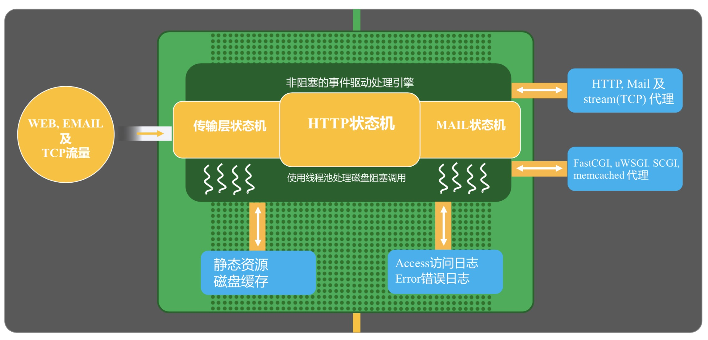
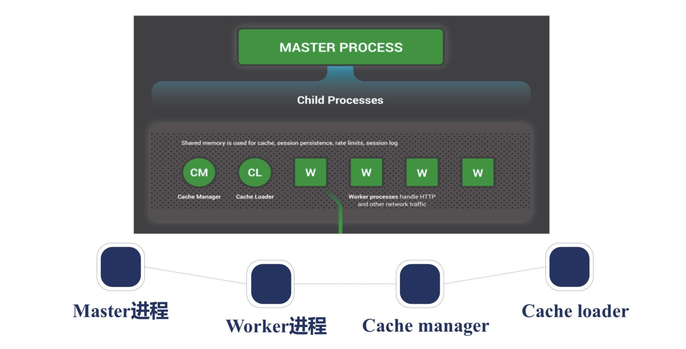
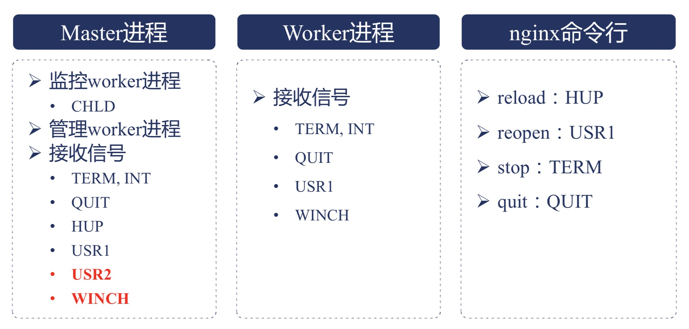
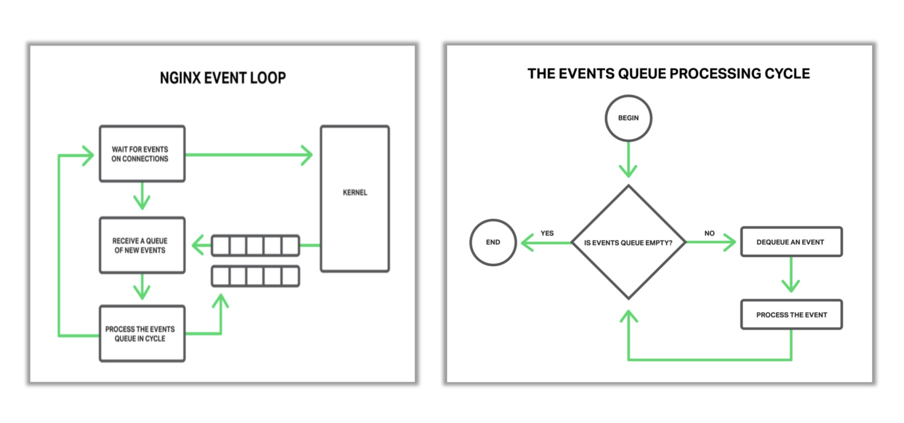
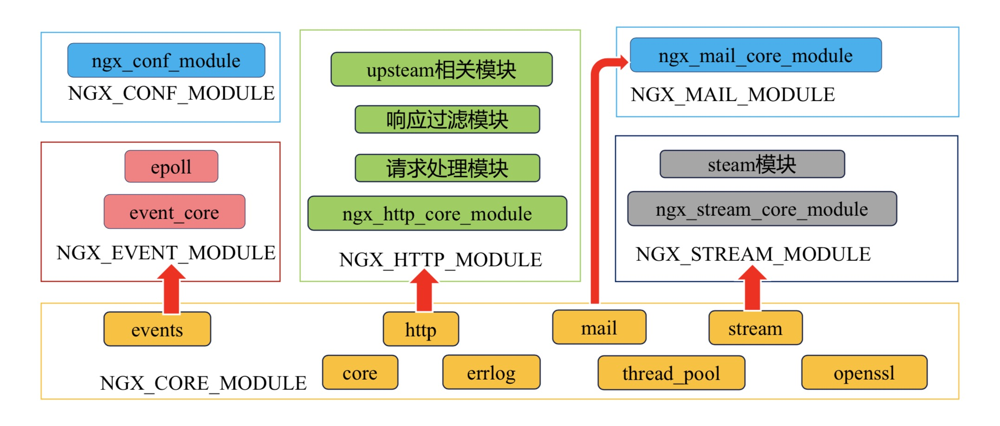

# nginx的架构

## nginx的请求处理流程
下面这张图展示了一个请求是如何被nginx处理的

nginx作为一个流量派发的中间件，主要存在下面三种流量
1. web
2. Email
3. TCP
图中的非阻塞事件驱动处理引擎会将对应的流量派发给对应的状态机去处理，nginx有对应三个状态机去处理
1. HTTP状态机
2. MAIL状态机
3. 传输层状态机

请求处理结果主要有静态和动态，图中的静态资源就是属于静态，图中的HTTP、Mail代理是通过再请求其它服务器来获取结果，图中的FastCGI、uWSGL、SCGL等是应用层的协议，比如很多后台语言都实现了FastCGI协议，nginx就是通过这个协议去向他们获取请求结果

请求完成后会记录对应的access日志和error日志，通过上述步骤一个请求就完成了

## nginx的进程结构
nginx支持多进程和单进程结构，默认nginx开启的是多进程结构。下图是nginx的进程结构模型

从图中可以看出，包括如下进程
1. master process：master负责管理worker进程
2. child processes
- worker processes：所有的请求都是通过worker进程处理的，处理缓存相关的请求是通过向cache相关进程直接获取结果的，进程之间通信是通过共享内存的方式
- cache process：所有缓存相关的处理都会给这些进程

### worker进程的个数
worker进程的个数可以通过配置文件来设置，通常设置成cpu核的数量，还可以设置将worker进程和对应的CPU进行绑定，以充分利用CPU

## nginx的进程管理
nginx进程管理是通过向进程发送不同的信号来实现管理的，如下图

说明：

### master进程
master进程会启动并监控worker进程，子进程在关闭时会向父进程发送`CHLD`信号，父进程收到信号就会重启一个worker进程；还可以向master发送信号来实现对worker进程的管理，master进程收到信号后会将信号发给worker进程，master接收如下信号
- TERM,INT：立刻停止nginx的所有进程
- QUIT：优雅的停止nginx的所有进程
- HUP：重载配置文件
- USR1：重新打开日志文件，在做日志文件切割的时候会使用到
上面四个是可以对应了nginx命令行中的4种命令的，下面这两种只能通过`kill`命令来向master进程发送，kill命令需要master进程的的pid，这个pid是记录在了`logs`目录中的`nginx.pid`文件中，`nginx -s`m命令也是通过这个文件得到的nginx的master进程ID的
- USR2：再启动一个nginx服务，并优雅的将请求过渡给新启动的nginx
- WINCH：关闭掉所有的worker进程，保留master进程
上述两个信号通常在热部署的时候会使用到

## reload重载配置文件的真相
在执行`nginx -s reload`命令后，发生了如下的事情
1. 向master进程发送HUP信号
2. master进程校验配置语法是否正确
3. master进程打开新的监听端口（配置文件存在新增加监听的端口）
4. master进程用新配置启动新的worker子进程
5. master进程向旧的worker进程发送QUIT信号（优雅结束进程）
6. 旧的worker进程关闭监听句柄，处理完当前连接后结束进程

执行完上面六步，就完成了nginx的平滑重启

## 热升级具体流程
1. 先将nginx启动的二进制文件进行备份，再将编译的新版本二进制文件替换掉旧版本的
2. 向master进程发送USR2信号
3. master修改进程修改nginx.pid文件的名字，加后缀.oldbin
4. master进程用新的nginx二进制文件启动新的master进程
5. 向旧的master进程发送WINCH信号，关闭掉旧的worker进程，保留老的master进程
6. 回滚：向旧的master发送HUP信号，向新的master发送QUIT信号

## 优雅关闭worker进程
nginx只能做到对http请求，其它请求是不可以的。优雅的关闭主要经历如下阶段
1. 设置定时器woker_shutdown_timeout，这个时间是通过配置文件来设置的
2. 关闭监听句柄，就是新的请求将会交给新启动的worker去处理
3. 关闭空闲连接
4. 在循环中等待全部连接关闭
5. 退出进程

## nginx的事件驱动模型
nginx在启动后，不同的请求都是以事件的形式被nginx接收，事件是按照下图被处理的

请求会被当作事件的形式放入到一个事件队列中，nginx会去处理队列里面的事件，在处理事件时，也可向队列中加入新的事件，比如我对一个http请求处理完成了，需要向客户端返回数据了，需要往队列中加入一个事件；当事件队列为空之后，就回到了wait for events on connection（等待连接事件）

## nginx的模块
使用nginx的模块，需要注意以下几点
1. 编译安装时，是否将模块编译进来了
2. 模块提供哪些配置项
3. 模块何时被使用，有些模块默认会被使用，有些模块需要加入特定配置项并配置正确才会被使用
4. 模块提供哪些变量可以使用

了解一个模块如何使用，可以通过官方文档查看，如果你能阅读源码，可以在解压后的文件夹中src中找到`.c`结尾的源码文件，源码文件中使用`ngx_command_t`结构体定义该模块能使用的指令，官方文档中没有的指令可能在源码中就能找到

### 模块的分类
下图是nginx的模块分类图
