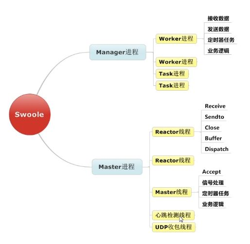

# Server详解
## 启动server流程图
下图是官方的启动server的流程图

之前的入门篇介绍了创建一个http-server和websocket-server，这两种server都是继承自`swoole\server`的，所以下面讲的同样适用swoole入门篇的server

启动server前通常需要做以下三个步骤
1. 实例化server对象，需要设定绑定ip和端口号
2. 设置server启动前的配置选项
3. 注册不同事件回调处理函数，官方文档中支持13种事件

图中$serv->start()后，会存在三种类型的进程（master，manager，worker、taskWorker），下节通过启动一个server，结合ps和pstree命令来查看启动server之后的进程结构

## Server的进程模型
Server存在[两种运行模式](https://wiki.swoole.com/wiki/page/353.html)，单线程模式和进程模式，下面我们只介绍进程模式

先看如下server.php代码
``` php
$serv = new Swoole\Server('0.0.0.0', 9501, SWOOLE_PROCESS, SWOOLE_SOCK_TCP);

$serv->on('start', function ($server) {
    echo 'master进程ID：' . $server->master_pid . PHP_EOL;
    echo 'manager进程ID：' . $server->manager_pid . PHP_EOL;
    var_dump($server->setting);
});

$serv->on('WorkerStart', function (Swoole\Server $server, int $worker_id) {
    if ($server->taskworker) {
        echo 'taskWorker进程ID：' .$server->worker_pid . PHP_EOL;
    } else {
        echo 'worker进程ID：' .$server->worker_pid . PHP_EOL;
    }
});

$serv->start();
```
在命令行中输入`php server.php`启动server，在命令行会看到如下的打印信息
``` bash 
master进程ID：640
manager进程ID：641
array(4) {
  ["worker_num"]=>
  int(4)
  ["task_worker_num"]=>
  int(0)
  ["buffer_output_size"]=>
  int(2097152)
  ["max_connection"]=>
  int(7168)
}
worker进程ID：642
worker进程ID：643
worker进程ID：644
worker进程ID：645
```
代码中其实没有指定任何的server配置项，但是确打印出来了4个配置项，而且其中的worker进程的数量为4

使用`ps aux | grep server.php`
``` bash
simon              656   0.0  0.0  4286452    832 s001  S+    1:19PM   0:00.00 grep --color=auto --exclude-dir=.bzr --exclude-dir=CVS --exclude-dir=.git --exclude-dir=.hg --exclude-dir=.svn server.php
simon              645   0.0  0.0  4375576   3196 s002  S+    1:19PM   0:00.00 php server.php
simon              644   0.0  0.0  4367384   3244 s002  S+    1:19PM   0:00.00 php server.php
simon              643   0.0  0.0  4375576   3192 s002  S+    1:19PM   0:00.00 php server.php
simon              642   0.0  0.0  4375576   3196 s002  S+    1:19PM   0:00.00 php server.php
simon              641   0.0  0.0  4377504    620 s002  S+    1:19PM   0:00.00 php server.php
simon              640   0.0  0.4  4389680  30768 s002  S+    1:19PM   0:00.14 php server.php
```
第一行使用grep命令产生的进程可以忽略，可以看到第二列的进程ID和之前启动server时打印的进程ID一致，而且worker进程的个数为swoole扩展自己定义

使用命令`pstree -p 640`，640为之前的master进程ID，打印出如下信息
``` bash 
-+= 00001 root /sbin/launchd
 \-+= 93751 simon /Applications/iTerm.app/Contents/MacOS/iTerm2
   \-+= 94118 simon /Applications/iTerm.app/Contents/MacOS/iTerm2 --server login -fp simon
     \-+= 94119 root login -fp simon
       \-+= 94120 simon -zsh
         \-+= 00640 simon php server.php
           \-+- 00641 simon php server.php
             |--- 00642 simon php server.php
             |--- 00643 simon php server.php
             |--- 00644 simon php server.php
             \--- 00645 simon php server.php
```
可以很清楚的看到进程之间的关系，下面看一下官方给出的进程结构图

下图为官方给出的各种进程的主要处理的任务


总结：

swoole启动一个Server后，会存在2+N+M个进程，N表示worker进程的个数，M为taskWorker进程个数，一下就是
1. Master：是一个多线程程序
2. Manager
- 专门负责worker/task进程的fork操作和管理, manager的任务本来可以由master进程来负责，对于多线程的Master进程而言，想要多Worker进程就必须fork操作。通常，worker进程被误杀或者由于业务代码出现异常的原因会导致进程异常退出，Manager进程为了保证设计上master进程的稳定，将worker进程管理交给了manager进程
3. worker/taskWorker：
- worker：主要业务逻辑都是都是在worker进程中处理
- task：耗时任务一般都会在worker进程中将任务投递给这个进程处理

## server启动配置项
